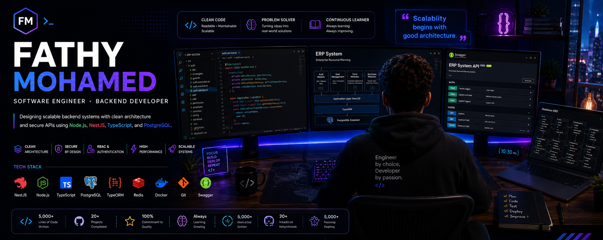

  

  

 

<h2 align="center">About Me</h2>

Backend Software Engineer with a passion for designing scalable backend systems and secure REST APIs.

I specialize in <b>Node.js</b>, <b>NestJS</b>, <b>TypeScript</b>, and modern backend architecture,
following clean code principles and software engineering best practices.

 

<h2 align="center">Current Focus</h2>

Building a scalable <b>Enterprise ERP System</b>

<b>NestJS • PostgreSQL • TypeORM</b>

 Authentication &nbsp;&nbsp;•&nbsp;&nbsp;
 RBAC & Permissions &nbsp;&nbsp;•&nbsp;&nbsp;
 Clean Architecture &nbsp;&nbsp;•&nbsp;&nbsp;
 Scalable APIs

 

<h2 align="center">Backend Expertise</h2>

 

<h2 align="center"> Tech Stack</h2>

<b>Backend</b> 

  
<b>Database</b> 

  
<b>Tools</b> 

  

 

 

<h2 align="center">Contribution Snake</h2>

 

 

<h2 align="center"> Connect With Me</h2> 

 

<h2 align="center">Thanks for Visiting 👋</h2>

<i>"Build software that scales, not just software that works."</i>

Thanks for checking out my profile.
Feel free to explore my repositories, and don't forget to ⭐ the projects you find useful.

